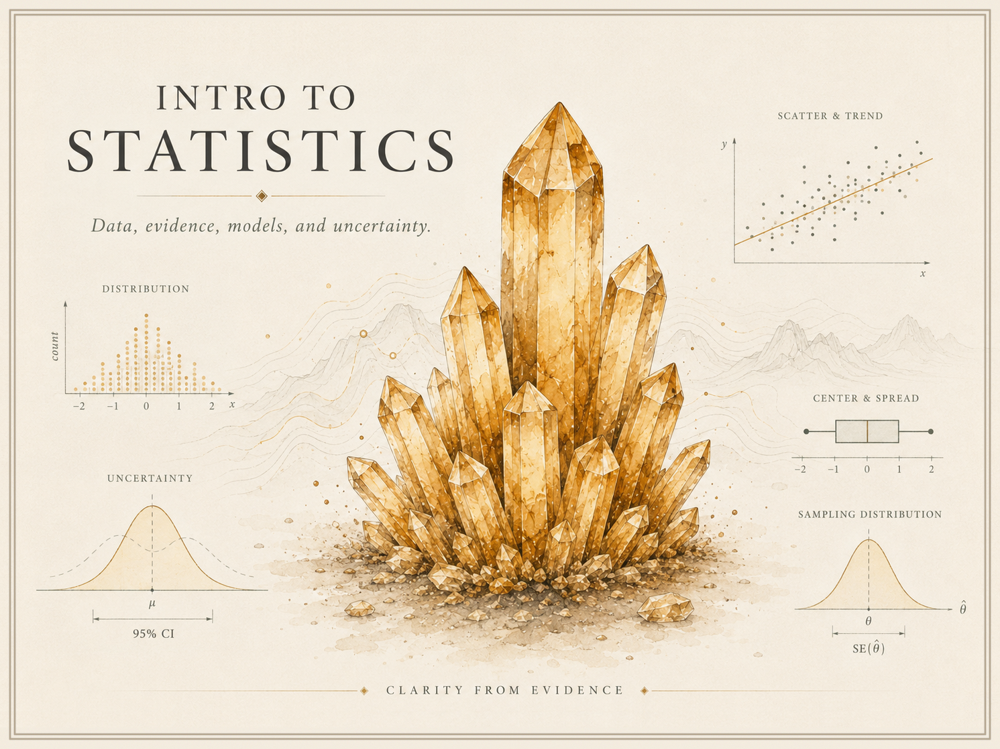

{fig-alt="Wide illustrated course identity image for Intro to Statistics, showing an amber crystal cluster surrounded by introductory statistics graphics including distributions, uncertainty, scatterplots, center and spread, and sampling distributions." .course-hero-img}

This site collects public-facing resources for **Intro to Statistics** —
the concepts, activities, and interpretation-focused examples behind
reasoning with **data, evidence, models, and uncertainty**. Curated by
[Matt Hester](https://matthewhester.com).

It is a **curated resource site**, not a raw course archive. Anything
syllabus- or roster-specific lives in the LMS; this site is what stays
public.

## Where to start

- [Syllabus](syllabus.qmd) — public course overview and how this site
  relates to Blackboard
- [Schedule](schedule.qmd) — week-by-week topic map with links to the
  weekly notes
- [Notes](notes/index.qmd) — weekly notes and conceptual write-ups
- [Activities](activities/index.qmd) — how in-class activities work
  (most are embedded in the weekly notes)
- [Assignments](assignments/index.qmd) — index of the public weekly
  exit tickets
- [Projects](projects/index.qmd) — public project orientation
- [Resources](resources/index.qmd) — readings, tools, and links
  (IMS, ISLBS, and StatKey / simulation support)
