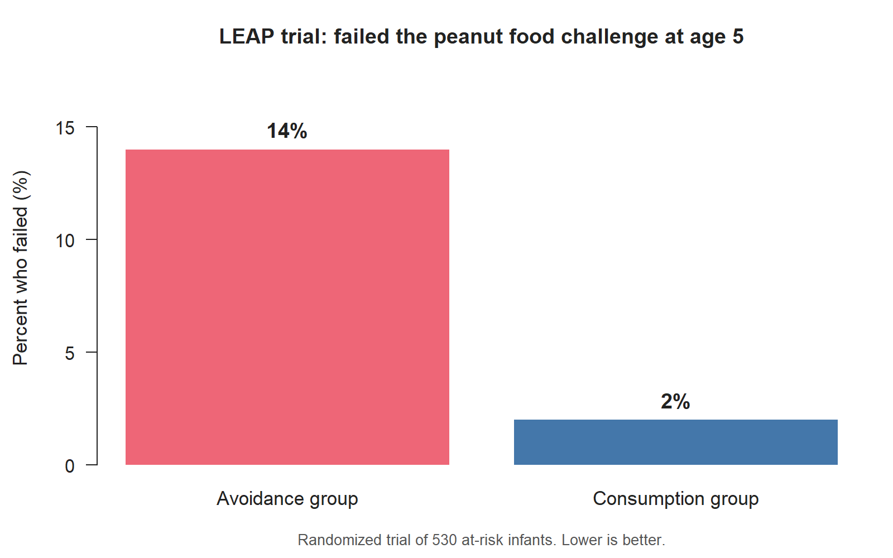
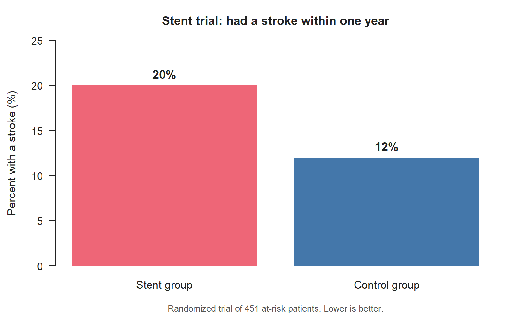

## Why this week matters

Statistics is not a stack of formulas. It is a way to evaluate
**evidence** — to decide what you can and cannot reasonably claim
from a set of numbers. Before any technique works, you have to be
able to look at a dataset and answer four basic questions:

- Who or what is being measured?
- What was measured about them?
- What is the question we're trying to answer?
- What does the data, on its face, show?

This week is about getting fluent at those four questions on a small
scale. By Friday you will look at a short study description and a
small table and be able to talk back to it in clear, careful
sentences. The bigger questions — *how* the data were collected, what
biases could be hiding inside it, what claims it does and does not
support — start in earnest in Week 2.

## What counts as data?

When researchers measure or record something, they usually organize
the result as a **dataset**: a structured collection of observations,
recorded in a consistent way, so anyone reading the dataset later can
see what was measured, on whom, and how.

Two small examples we will keep coming back to this semester.

**The LEAP trial.** A public-health team studies whether early peanut
exposure helps prevent peanut allergies in young children. They
enroll 530 infants who are at risk of developing peanut allergy,
randomly assign each child to either eat peanut products regularly
(the "consumption" group) or avoid them (the "avoidance" group), and
check at age five whether each child can safely eat peanuts. The
final dataset records, for each child, which group they were in and
whether they passed the food challenge. The reported result is
striking: about 14% of children in the avoidance group failed the
food challenge, compared with about 2% in the consumption group.

{fig-alt="Bar chart comparing a 14 percent failure rate in the avoidance group to a 2 percent failure rate in the consumption group."}

**The stent trial.** A different team runs a randomized study of 451
patients at risk of stroke. Patients in the treatment group receive
a stent (a small mesh tube placed in a narrow artery) plus standard
medical management; patients in the control group receive the
standard medical management alone. The dataset records, for each
patient, which group they were in and whether they had a stroke
within 30 days and within one year. The reported result is also
striking — but in the opposite direction: about 20% of patients in
the stent group had a stroke within a year, compared with about 12%
of patients in the control group.

{fig-alt="Bar chart comparing a 20 percent stroke rate in the stent group to a 12 percent stroke rate in the control group."}

Two well-run randomized studies; two striking results that point in
opposite directions. The point isn't that one is right and one is
wrong. The point is that **statistics is what lets you read each
dataset carefully enough to decide what it does and does not
support**. We will return to both studies more than once this
semester.

The key point right now: the dataset is what makes the analysis
*possible*. Statistics starts when you can read the dataset.

## Cases, variables, and data tables

Most datasets you see in this class will look like a table — rows
and columns:

| Patient ID | Treatment group   | Passed food challenge? |
|-----------:|-------------------|-------------------------|
| 100522     | Peanut consumption| Yes                     |
| 103358     | Peanut consumption| Yes                     |
| 105069     | Peanut avoidance  | Yes                     |
| 994047     | Peanut avoidance  | Yes                     |
| 997608     | Peanut consumption| Yes                     |

The vocabulary:

- A **case** is one row. In this table each case is one child in the
  study.
- A **variable** is one column. Here the variables are *patient ID*,
  *treatment group*, and *passed food challenge?*.
- A **data table** (or **data matrix**) is the whole grid.

Cases are not always people. Here are some examples of cases you'll
see this term:

- One **patient** on a hospital ward.
- One **breath sample** from an asthma study.
- One **birth** in a hospital records database.
- One **county** in a public-health comparison.
- One **frog egg clutch** in a biology study of maternal investment.

Whenever you read a new study description, the first thing to ask
is: *what is one case here?* If you can answer that, the rest of the
dataset's structure usually clicks into place.

Sometimes a data table contains a blank, missing entry, or a code
like `NA`. That usually means the value was not recorded for that
case. It is not a new variable; it is a missing value for an
existing variable.

## Types of variables

Once you know what your cases are, the next question is what kind of
variables they have. There are two main types.

### Numerical variables

A **numerical variable** records a number where the numerical
relationships are meaningful — you can sensibly add, subtract,
average, or compare two values.

- **Continuous** numerical variables can take any value within a
  range. Height in centimeters, systolic blood pressure in mmHg,
  PM₁₀ pollution levels in micrograms per cubic meter — all
  continuous.
- **Discrete** numerical variables jump between separate values,
  usually integers. Number of hospital admissions per day, age in
  whole years — discrete.

A telephone number is *not* a numerical variable, even though it
looks like digits. You can't sensibly average phone numbers.

### Categorical variables

A **categorical variable** records a label that tells you which
group the case belongs to. The possible labels are called the
**levels** of the variable.

- A **nominal** categorical variable has levels with no natural
  ordering. Race, sex, dining station, blood type — nominal.
- An **ordinal** categorical variable has levels that do have a
  natural order. Pain rating on a 0–10 scale grouped into "low /
  moderate / severe", or age grouped into 5-year bins — ordinal.

Some variables look numerical but are best treated as categorical in
context. If a researcher records data from 11 specific study sites
and labels them 1 through 11, the site number is technically a
number but it doesn't make sense to "average two sites." In context,
the site label is categorical.

## Response and explanatory variables

When a study asks a question like "does *this* affect *that*," the
"that" is the **response variable** (the outcome of interest) and
the "this" is the **explanatory variable** (the variable the study
is examining to see how the response changes).

Three quick examples:

| Research question | Explanatory variable | Response variable |
|---|---|---|
| Does early peanut exposure reduce peanut-allergy rates? | Treatment group (consumption vs avoidance) | Passed the food challenge at age 5? (yes / no) |
| Does PM₁₀ exposure during pregnancy increase the chance of preterm birth? | Average gestational PM₁₀ exposure | Preterm-birth status (yes / no) |
| Does altitude affect frog reproductive investment? | Altitude of the study site | Clutch size, egg size, clutch volume |

Two important habits:

- "Response" and "explanatory" are properties of *the research
  question*, not of the variables themselves. The same variable could
  be a response in one study and an explanatory variable in another.
- Not every variable in a dataset has a role. In the frog example,
  the researchers also recorded *latitude* and *body size of the
  mother*. Latitude is environmental context; body size is an
  auxiliary variable. Neither is the explanatory or the response
  variable of *this* study.

When you read a study description, identify the research question
first, then point at which variables fill which role.

## Evidence, claims, and context

A dataset, by itself, is just rows and columns. It becomes
**evidence** when someone uses it to support a claim — and that
claim is only as good as the dataset behind it.

Three habits to start practicing this week:

1. **Read the numbers in context.** A two-way table that shows ~14%
   of children in the LEAP avoidance group failed the food challenge
   and ~2% in the consumption group failed it is striking. So is a
   summary that shows 20% of stent-group patients had a stroke
   versus 12% of control-group patients. Each number tells you a
   lot, but no single number tells you everything. (We'll ask "could
   the difference be due to chance?" in Week 11, and "what about
   other studies?" in Week 14.)
2. **Distinguish what was measured from what wasn't.** If a study
   collected age, sex, and blood pressure but didn't collect
   exercise habits, you cannot say anything about exercise from
   that dataset.
3. **Be honest about how strong a single study's evidence is.** One
   study, even a well-run one, is one study. The LEAP and stent
   trials together illustrate this in opposite directions. We will
   get a lot more careful about this in Weeks 2, 11, and 14.

This isn't about being cynical. It is about being honest.

## Example: reading a small study dataset

Suppose a research team studies whether a shallow-breathing technique
helps reduce asthma symptoms. They enroll 600 adults aged 18–69 who
already rely on medication, randomly split them into two groups
(one practicing the technique, one not), and at the end of the study
score each participant on a 0–10 scale for symptom severity,
medication use, activity level, and overall quality of life.

Use the four habits from the last section:

- **What is one case?** One adult asthma patient enrolled in the
  study.
- **What variables were recorded?** Group assignment (technique vs
  not), and four 0–10 scores (symptom severity, medication use,
  activity, quality of life).
- **Which variables are categorical? Numerical?** Group is
  categorical (nominal). The four scores are numerical — you could
  argue they are discrete because they are whole numbers on a 0–10
  scale, or treat them as continuous because they are summary scores
  of underlying quantities. Either is defensible if you say which
  one you mean.
- **What is the response, and what is the explanatory variable?**
  Each of the four scores can be a response variable; group
  assignment is the explanatory variable.

That's the kind of reading we want by Friday.

## Common mistakes

These tend to come up in Week 1 and are worth heading off now.

- **"Case = patient."** Not always. A case might be a birth, a
  county, a clutch of eggs, or a day of measurements. Read the
  dataset description carefully before assuming.
- **"Numerical-looking = numerical variable."** Year, zip code, study
  site number, patient ID — all "look numerical" but they don't
  necessarily mean anything as a number. In context they are often
  categorical labels.
- **"This variable IS the response variable."** Response and
  explanatory roles depend on the question being asked, not on the
  variable itself.
- **"The numbers speak for themselves."** They don't. Numbers
  without a description of how they were collected, who they came
  from, and what was *not* measured are nearly impossible to read
  honestly.
- **"One striking result settles the question."** A single study
  can be a strong start but is rarely the end of the story. We'll
  develop this throughout the term.

## What you should be able to do by Friday

By the end of Week 1 you should be able to:

- Read a short study description and identify what one case is.
- Identify the variables in the dataset and classify each as
  numerical (continuous or discrete) or categorical (nominal or
  ordinal).
- State the research question and identify the response and
  explanatory variables.
- Recognize when a variable is auxiliary — neither the response nor
  the explanatory variable of the study in question.
- Read a small data matrix (5–10 rows) and a small two-way summary
  table without panic.
- Write one or two careful sentences about what a small dataset does
  and does not show.

The Wednesday in-class exit ticket is about this. The Friday quiz
and Homework 1 are too — they are handled separately (see below).

## Assignments this week

- 📄 **Monday exit ticket** — short concept check on the LEAP and stent
  variable types. Aim for **3–5 minutes**. \
  [Download the Monday exit ticket (PDF)](../assets/assignments/week01_monday_exit_ticket_student.pdf)
- 📄 **Wednesday exit ticket** — read two small datasets (MCU films and
  a frog data matrix) and classify the variables. Aim for
  **8–12 minutes**. \
  [Download the Wednesday exit ticket (PDF)](../assets/assignments/week01_wednesday_exit_ticket_student.pdf)
- 🔒 **Friday quiz** — handled through Blackboard or in class as
  directed. The quiz prompt is not posted here. Exact timing and
  submission details live in Blackboard.
- 🔒 **Homework 1 (biweekly, covers Weeks 1–2)** — posted and submitted
  through Blackboard. Due near the start of Week 3; exact due date
  is on Blackboard.

## Read more in IMS / ISLBS

The course page above is the main explanation for this week. If you
want a second voice on the same material, the following readings
cover the same concepts:

- **IMS — Chapter 1 ("Hello, data")**, §1.1 stent case study and
  §1.2 data basics. \
  Hosted IMS book: <https://openintro-ims.netlify.app/>
- **ISLBS — *Introductory Statistics for the Life and Biomedical
  Sciences*, Chapter 1**, §1.1 LEAP case study and §1.2 data basics. \
  OpenIntro book page: <https://www.openintro.org/book/biostat/>

---

*Sources adapted in this lesson:* OpenIntro *Introduction to Modern
Statistics* (2e), Çetinkaya-Rundel & Hardin, Chapter 1
("Hello data"), §1.1 stent case study + §1.2 data basics, CC BY-SA 3.0;
and OpenIntro *Introductory Statistics for the Life and Biomedical
Sciences*, Vu & Harrington, Chapter 1 §1.1 LEAP case study + §1.2
data basics, CC BY-SA 3.0. Source files at
[github.com/openintrostat/ims](https://github.com/openintrostat/ims)
and
[github.com/OI-Biostat/oi_biostat_text](https://github.com/OI-Biostat/oi_biostat_text).
The LEAP study is Du Toit et al., *NEJM* 372 (2015) 803–813; the
stent study is Chimowitz et al., *NEJM* 365 (2011) 993–1003.
