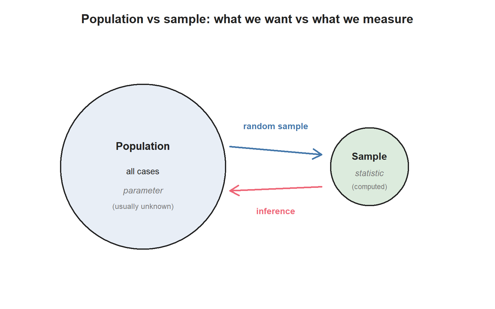
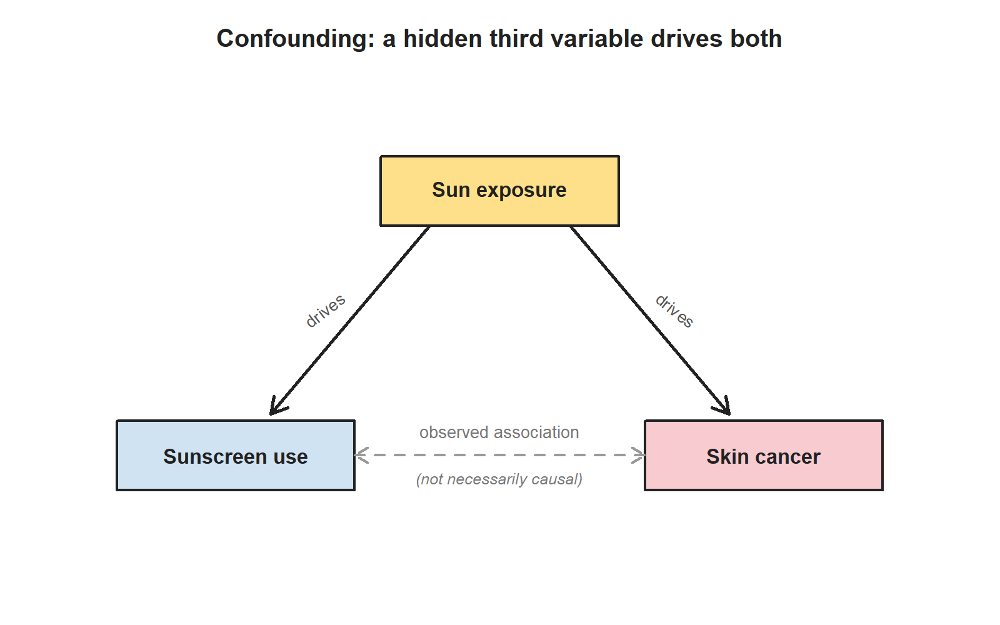

## Why this week matters

Last week we said statistics starts when you can read a dataset.
This week we go one question earlier: **how were these data
collected?**

The answer matters more than the headline ever suggests. The same headline number
— "patients on this drug had a stroke 20% of the time" — can be
strong evidence, weak evidence, or no evidence at all, depending on
how the data underneath were collected. A randomized trial of 451
patients tells you one thing. A retrospective chart review of a
self-selected group tells you something very different. By Friday
you should be able to look at a short study description and judge,
honestly:

- *Who or what does this study actually generalize to?*
- *Was this an experiment or an observational study?*
- *Are causal claims here defensible?*
- *What else could explain what we see?*

The point is simple: before we interpret a result, we need to know
how the data were collected. Read the design before trusting the
claim — it's the habit everything else in the course passes through.

## Populations, samples, and study claims

Every study has a **population** in mind — the full group of cases
the research question is really about. Three examples:

| Research question | Population (what the study is really about) |
|---|---|
| What is the average mercury content in swordfish in the Atlantic Ocean? | All swordfish in the Atlantic Ocean. |
| Over the last five years, what is the average time to complete a degree for our university's undergraduates? | All recent undergraduates at our university who finished a degree. |
| Does a new drug reduce the rate of deaths in patients with severe heart disease? | All patients with severe heart disease (or some clearly described subset of them). |

In practice, no one measures the entire population. Researchers
collect a **sample** — a small fraction of the population they can
actually observe. The summary numbers they compute from a sample
are called **sample statistics**. The corresponding numbers we *would*
get if we measured the whole population are called **population
parameters**. Sample statistics are our best guess at population
parameters; they are not the same thing.

You'll see these four words a lot this term:

- **Population** — what the question is about.
- **Sample** — who or what we actually measured.
- **Parameter** — a number describing the population (usually
  unknown).
- **Statistic** — a number describing the sample (always
  computable from data).

{fig-alt="Schematic showing a large population circle, a random-sample arrow to a small sample circle, and an inference arrow back to the population."}

## Sampling and representativeness

A sample is useful only if it looks like the population it's meant
to represent. If the sample is built in a way that systematically
leaves people out, or systematically over-counts a particular
group, it is **biased** — and analysis on a biased sample can
mislead you even if every individual measurement is perfect.

The cleanest way to avoid sample bias is **random sampling**: every
case in the population has the same chance of being chosen. The
simplest version is called a **simple random sample** (SRS): imagine
writing every patient's name on a card and pulling cards out of a
hat at random. The US Centers for Disease Control runs a real
example — the Behavioral Risk Factor Surveillance System (BRFSS) —
which conducts over 400,000 telephone interviews per year using a
randomized procedure. That's how we get population-level estimates
about smoking, exercise, and chronic conditions.

A few traps to watch for:

- **Convenience sampling.** Asking the patients who are easiest to
  reach. Easy to do; almost always biased. (If you survey only the
  patients in the waiting room, you are not surveying the patients
  who don't need to be in the waiting room.)
- **Voluntary response.** Letting respondents self-select into the
  sample. People with strong feelings are over-represented.
- **Non-response bias.** Some people you tried to reach didn't
  respond. If non-responders differ systematically from responders,
  your data are skewed.

You'll see two more sampling words this term in passing:
**stratified sampling** (split the population into groups first,
then randomly sample within each) and **cluster sampling** (sample
whole groups, not individuals). We will not drill these — most of
the analyses you'll meet later in this course assume simple random
sampling.

## Observational studies and experiments

There are two big families of studies, and they support very
different kinds of claims.

In an **experiment**, researchers *assign* who gets which treatment.
The peanut-allergy LEAP trial from Week 1 is an experiment: each
infant was randomly assigned to either eat peanut products or
avoid them. The stent trial from Week 1 is also an experiment:
each patient was randomly assigned to receive a stent or not.

In an **observational study**, researchers *observe* what happens
without intervening. The Nurses' Health Study has followed more
than 275,000 nurses since 1976, collecting surveys every two years
on diet, behavior, and health. Nobody assigned the nurses to eat
more or less fat; the researchers simply recorded what the nurses
ate and what happened to them later.

A useful rule of thumb:

> **Experiments can support causal claims. Observational studies
> can support association claims.**

That's the entire reason random assignment matters. Random
assignment makes the treatment group and the control group, on
average, similar in every way *except* the assigned treatment. If
the groups then differ in outcome, the assigned treatment is the
most plausible explanation. Without random assignment, you can
never be sure.

## Random assignment and causal claims

When an experiment is well designed, four principles do most of the
heavy lifting:

- **Control.** Researchers try to hold extraneous conditions fixed
  (everyone takes the pill with a full glass of water; everyone
  takes the test in the same room) so the only systematic
  difference between groups is the treatment.
- **Randomization.** Randomly assigning patients to groups balances
  the groups, on average, for things we can't control or didn't
  even think to measure (genetics, sleep that week, mood, severity
  of disease before enrollment).
- **Replication.** Bigger samples give more reliable estimates than
  small ones. And replicating an entire study — running it again,
  with a new sample — is how we know the first result wasn't a
  fluke. ("Failure to replicate" is a major issue in many fields
  right now.)
- **Blocking** (briefly). If we already know one variable is going
  to matter — say, baseline disease severity — we can group
  patients by severity first, then randomly assign within each
  group. That guarantees an even mix in both arms.

Two more design ideas come up specifically in human studies:

- A study is **blind** when participants don't know which group
  they were assigned to. A **placebo** — an inert pill that looks
  like the real one — is how researchers keep the control group
  blind without lying about who got what.
- A study is **double-blind** when neither participants nor the
  doctors interacting with them know who got which treatment. This
  keeps physicians from inadvertently treating the two groups
  differently.

A real example. In the stent trial from Week 1, the patients knew
which group they were in (a stent is a surgery; the control patients
didn't have surgery). So the study was an experiment, but it was
neither blind nor double-blind. The researchers could have run a
**sham surgery** — a surgical procedure that doesn't actually place
a stent — to blind the patients, but sham surgeries raise real
ethical questions: you're imposing surgical risk on someone to
preserve the study's design. There's no perfect answer.

## Bias, confounding, and overclaiming

Now to the deeper trap: **confounding**.

A **confounding variable** is a variable that is associated with
both the explanatory variable and the response variable. When a
confounder is present, an observed association between explanatory
and response might not be caused by the explanatory at all — it
might just be the confounder pulling both.

A classic example: an observational study tracks sunscreen use and
skin-cancer rates and reports that people who use *more* sunscreen
are *more* likely to develop skin cancer. Does sunscreen cause skin
cancer? Almost certainly not. The hidden third variable is
**sun exposure**: people who are outside in the sun a lot use more
sunscreen *and* get more skin cancer. Sun exposure is the
confounder.

{fig-alt="Diagram: sun exposure points to both sunscreen use and skin cancer; sunscreen use and skin cancer are joined by a dashed observed-association arrow labeled not necessarily causal."}

This is why a careful observational study can show association but
cannot, on its own, prove causation. A confounder might always be
hiding. Random assignment — which only experiments can do — is
what breaks that bind.

A handful of other words that come up in this conversation:

- **Anecdotal evidence**: drawing a conclusion from one or two
  striking cases ("my uncle smoked his whole life and lived to 95,
  so smoking must not be that bad"). Striking and memorable; not
  evidence. But: an anecdote can be a *useful starting point* that
  motivates a real study. In 1958, a Vancouver general practitioner
  noticed that several of his elderly patients with a specific
  heart-valve condition were also experiencing severe
  gastrointestinal bleeding. That observation prompted the research
  that eventually identified Heyde Syndrome. Anecdote alone wasn't
  proof; it was a useful *question*.
- **Overclaiming**. Going beyond what the data support — usually by
  saying "X causes Y" when the data only support "X is associated
  with Y." It is one of the most common reading errors in popular
  science writing.

## Example: reading a study design

In Week 1 we met an observational study of air pollution and
preterm birth: researchers collected California hospital records
for 143,196 births and computed each pregnancy's average exposure
to several pollutants. Higher PM₁₀ exposure was associated with
higher preterm-birth rates.

Reading the design this week:

- **Type of study?** Observational. Nobody assigned anyone to a
  level of pollution exposure.
- **Population the study is really about?** Births in Southern
  California in 1989–1993, or some closely-related population.
  Whether the results generalize to other places (rural areas,
  different decades, different pollution mixes) is a separate
  judgment.
- **Causal claim?** Not directly. The association is real, but
  many confounders are possible — maternal income, neighborhood
  resources, occupational exposures, prenatal care access. The
  observational design cannot rule them out by itself.
- **Useful?** Absolutely. The association is striking enough to
  motivate further studies, regulatory questions, and follow-up
  research with better confounder control.

Now compare to the Week 1 LEAP trial: same Week 1 study, very
different design.

- **Type of study?** Randomized experiment.
- **Population?** Infants at risk of peanut allergy.
- **Causal claim?** Defensible. Random assignment, large sample,
  pre-registered outcome.
- **Caveats?** Still: one study, one population, one specific
  protocol. The general lesson — "introduce peanut early, not
  late" — does not automatically apply to children without the
  enrollment-criteria risk factors.

Both studies are useful evidence. Neither is the final word on
anything. *That* is the Week 2 habit we want.

## Common mistakes

These come up every Week 2 quarter.

- **"A random sample is a perfect sample."** No. A random sample
  removes one specific kind of bias (the bias of *who you chose*).
  It does not protect you from non-response, coverage gaps, or
  small sample size.
- **"Every experiment is a clinical trial."** Most aren't. A
  classroom soda-preference experiment, a study assigning students
  to different study materials, a study assigning chick embryos to
  different supplemented diets — all experiments.
- **"Random assignment proves the treatment caused the outcome."**
  It strongly supports a causal claim. It does not prove one.
  Sample size, adherence, dropout, and replication all still
  matter.
- **"Anecdotes are useless."** Not quite. Anecdotes are useless as
  *evidence* and useful as *questions*.
- **"Observational means biased; experimental means clean."**
  Observational studies can be carefully designed and still
  produce real, useful evidence. Experiments can have their own
  problems (sham surgery, blinding failures, ethical limits on
  what you can randomize). The two designs do different jobs.
- **"Confounder = anything that affects the outcome."** No — a
  confounder must be associated with *both* the explanatory
  variable and the response variable. (Sun exposure is associated
  with both sunscreen use and skin cancer. That's what makes it a
  confounder.)

## What you should be able to do by Friday

By the end of Week 2 you should be able to:

- Identify the population and the sample in a short study
  description, and judge whether the sample is likely to be
  representative.
- Distinguish a population parameter from a sample statistic.
- Name common sources of sample bias (convenience, voluntary
  response, non-response) and recognize each when you read about
  one.
- Decide whether a study is observational or experimental.
- Decide whether causal claims from a given study are defensible.
- Name a plausible confounding variable when an observational
  study reports an association.
- Recognize blind / placebo / double-blind designs in human
  studies and explain why they matter.

Homework 1 covers Week 1 + Week 2 material together. It is handled
separately (see below).

## Assignments this week

- 📄 **Monday exit ticket** — observational vs experimental snap check,
  plus a parameter-vs-statistic check. Aim for **3–5 minutes**. \
  [Download the Monday exit ticket (PDF)](../assets/assignments/week02_monday_exit_ticket_student.pdf)
- 📄 **Wednesday exit ticket** — scope-of-inference work on two studies
  from Week 1, one observational and one experimental. Aim for
  **8–12 minutes**. \
  [Download the Wednesday exit ticket (PDF)](../assets/assignments/week02_wednesday_exit_ticket_student.pdf)
- 🔒 **Friday quiz** — handled through Blackboard or in class as
  directed. The quiz prompt is not posted here. Exact timing and
  submission details live in Blackboard.
- 🔒 **Homework 1 (biweekly, Weeks 1–2)** — posted and submitted through
  Blackboard. Due near the start of Week 3; exact due date is on
  Blackboard.

## Read more in IMS / ISLBS

The course page above is the main explanation for this week. If you
want a second voice on the same material, the following readings
cover the same concepts:

- **IMS — Chapter 2 ("Study design")**, §2.1 sampling principles,
  §2.2 experiments, and §2.3 observational studies. \
  Hosted IMS book: <https://openintro-ims.netlify.app/>
- **ISLBS — *Introductory Statistics for the Life and Biomedical
  Sciences*, Chapter 1, §1.3 data collection principles** (the
  ISLBS counterpart to the Week 2 material). \
  OpenIntro book page: <https://www.openintro.org/book/biostat/>

---

*Sources adapted in this lesson:* OpenIntro *Introduction to Modern
Statistics* (2e), Çetinkaya-Rundel & Hardin, Chapter 2 ("Study
design"), §2.1 sampling principles + §2.2 experiments + §2.3
observational studies, CC BY-SA 3.0; and OpenIntro *Introductory
Statistics for the Life and Biomedical Sciences*, Vu & Harrington,
Chapter 1 §1.3 data collection principles, CC BY-SA 3.0. Source
files at
[github.com/openintrostat/ims](https://github.com/openintrostat/ims)
and
[github.com/OI-Biostat/oi_biostat_text](https://github.com/OI-Biostat/oi_biostat_text).
The stent study is Chimowitz et al., *NEJM* 365 (2011) 993–1003;
the LEAP study is Du Toit et al., *NEJM* 372 (2015) 803–813. The
Heyde Syndrome reference is Heyde EC, *NEJM* 259 (1958) 196.
