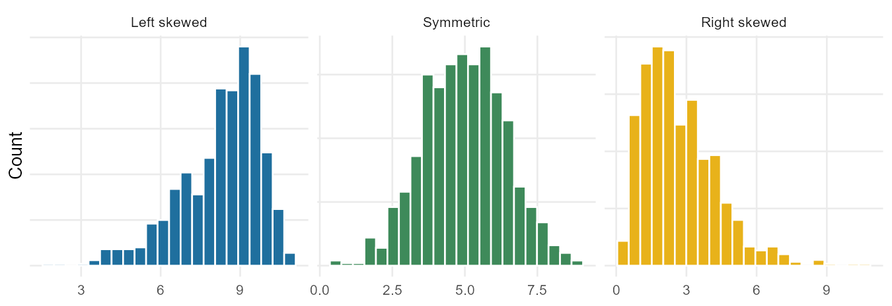

## Why this week matters

In Weeks 1 and 2 you learned to read a study: what one case is, what
the variables are, where the data came from, and what kind of claim
the design can support. This week you start *summarizing* what is
actually in the data.

A single variable — one column of a dataset — can have hundreds or
thousands of values. Nobody can hold all of them in their head. So we
describe a variable with a small number of well-chosen summaries: a
table or a graph that shows the overall pattern, plus a few numbers
that pin down where the values sit and how spread out they are.

The skill this week is **choosing the right summary and reading it
honestly**. A bar chart answers different questions than a histogram.
The mean and the median both claim to describe "the typical value,"
but they can disagree, and which one to trust depends on the shape of
the data. By Friday you should be able to look at one variable, pick
an appropriate summary, and describe it in careful sentences.

## First, what kind of variable is it?

Everything this week branches on one question you already know how to
answer: **is the variable categorical or numerical?** The two types
get different summaries.

- **Categorical** variables (labels — blood type, treatment group,
  genotype) are summarized with **counts and proportions**, shown in
  a frequency table or a bar chart.
- **Numerical** variables (quantities — blood pressure, recovery time,
  age) are summarized with a **center**, a **spread**, and a
  description of **shape**, shown in a histogram, dot plot, or box
  plot.

Get the variable type right and the rest of the week follows.

## Summarizing one categorical variable

For a categorical variable, the basic summary is a **frequency table**:
how many cases fall in each level. A **relative frequency table**
shows the same thing as proportions (counts divided by the total),
which makes it easier to compare groups of different sizes.

Suppose a genetics study records each participant's genotype at one
location on a gene, with three possible levels — CC, CT, and TT.

| Genotype | Count | Proportion |
|:--------:|------:|-----------:|
| CC       | 173   | 0.29       |
| CT       | 261   | 0.44       |
| TT       | 161   | 0.27       |
| **Total**| **595** | **1.00**  |

The same information is shown as a **bar chart**, where the height of
each bar is the count (or the proportion) in that level. A bar chart
makes the comparison between levels immediate: CT is clearly the most
common genotype here.

A **pie chart** shows the same breakdown as slices of a circle. Pie
charts can work when there are only a few levels and the slices are
simple fractions, but they get hard to read fast. With more than three
or four levels, or when two slices are close in size, a bar chart is
almost always easier to read. Be careful: a pie chart can hide an
ordering that a bar chart makes obvious.

One rule worth stating plainly: **a bar chart is not a histogram.** Bar
charts are for categorical variables, and the bars have gaps between
them because the levels are separate groups. Histograms (next section)
are for numerical variables, and the bars touch because the number
line is continuous.

## Summarizing one numerical variable: shape

For a numerical variable, start by looking at the whole distribution
before you compute anything. A **histogram** groups the values into
bins and draws a bar for the count in each bin. The picture tells you
the **shape** of the distribution.

{fig-alt="Three histograms side by side showing a left-skewed distribution, a symmetric distribution, and a right-skewed distribution."}

The vocabulary for shape:

- A distribution is **symmetric** if the two sides are rough mirror
  images.
- It is **right skewed** if it has a long tail stretching to the right
  (a few unusually large values). Income, hospital length of stay, and
  reaction times are usually right skewed.
- It is **left skewed** if the long tail stretches to the left.
- The number of clear peaks is the **modality**: one prominent peak is
  **unimodal**, two is **bimodal**, three or more is **multimodal**. A
  bimodal distribution is often a hint that two different groups are
  mixed together (for example, heights of children and adults
  measured as one variable).

Shape matters because it tells you which numerical summaries will be
trustworthy — that is the punch line of this whole week.

## Center: mean and median

Two summaries describe the **center** of a numerical variable.

- The **mean** (written $\bar{x}$, read "x-bar") is the average: add
  up all the values and divide by the number of cases, $n$. It is the
  balancing point of the distribution.
- The **median** is the middle value when the data are sorted. Half
  the cases fall below it and half above. If $n$ is even, the median
  is the average of the two middle values.

When a distribution is roughly symmetric, the mean and the median land
in about the same place. When it is skewed, they separate: the mean
gets pulled toward the long tail. In a right-skewed income
distribution, a handful of very large incomes drag the mean above the
median, so the mean overstates the "typical" income. That gap between
the mean and the median is itself a clue about shape.

A note on notation you'll see all term: $\bar{x}$ is the mean of a
**sample**, the cases we actually measured. The mean of the whole
**population** is written $\mu$ (the Greek letter "mu") and is usually
unknown — we estimate it with $\bar{x}$. That sample-versus-population
distinction is the same one from Week 2.

## Spread: standard deviation and IQR

Center alone is not enough. Two variables can have the same mean and
look completely different because their values are spread out
differently. Two summaries describe **spread**.

- The **standard deviation** (written $s$) measures, roughly, how far
  a typical value sits from the mean. A larger $s$ means the values
  are more spread out. The exact formula squares each value's distance
  from the mean, averages those, and takes a square root; you will not
  be asked to grind through it by hand, but you should know what it
  *means* — typical distance from the mean.
- The **interquartile range** (IQR) is the range of the middle half of
  the data: $\text{IQR} = Q_3 - Q_1$, where $Q_1$ (the first quartile)
  is the 25th percentile and $Q_3$ (the third quartile) is the 75th
  percentile. A **percentile** is the value below which that percent
  of the data falls — the 25th percentile has 25% of the data below
  it.

There is a rough rule of thumb for symmetric, bell-shaped
distributions: about two-thirds of the values fall within one standard
deviation of the mean, and about 95% within two. Treat this as a loose
guideline, not a law — it fails badly for skewed or bimodal data, and
we will make it precise much later in the course.

## Box plots and the five-number summary

A **box plot** packs the center and spread of a numerical variable
into one compact picture built from five numbers: the minimum, $Q_1$,
the median, $Q_3$, and the maximum.

{fig-alt="A histogram of a right-skewed variable above an aligned box plot, showing the box from the first to third quartile, the median line, whiskers, and several high outliers."}

How to read it:

- The **box** spans $Q_1$ to $Q_3$, so its length is the IQR — the
  middle 50% of the data.
- The line inside the box is the **median**.
- The **whiskers** reach out to the smallest and largest values that
  are not unusually far from the box.
- Points beyond the whiskers are flagged as potential **outliers** —
  values that sit far from the rest. A common rule flags anything more
  than $1.5 \times \text{IQR}$ beyond the quartiles.

A box plot is excellent for comparing center and spread, and it makes
outliers and skew easy to spot: when the median sits closer to $Q_1$
and there are high outliers, the distribution is right skewed. But a
box plot **cannot show modality** — a bimodal distribution and a
unimodal one can produce the same box. That is why we look at a
histogram too.

## Robust summaries: which number do you trust?

Here is the most important judgment of the week. **Outliers and skew
pull the mean and the standard deviation around, but barely move the
median and the IQR.** Watch what happens to summaries of the same
variable when one extreme value is moved:

| Scenario | Median | IQR | Mean | SD |
|---|---:|---:|---:|---:|
| Original data | 11.0 | 6.1 | 11.6 | 5.0 |
| Move the largest value up a lot | 11.0 | 6.1 | 12.4 | 6.8 |
| Move it down into the pack | 11.0 | 6.0 | 11.1 | 4.3 |

The median and IQR hardly budge; the mean and SD swing. Because the
median and IQR resist extreme values, we call them **robust**
statistics. The mean and standard deviation are **not robust**.

So which do you report?

- For a roughly **symmetric** distribution with no wild outliers, the
  **mean and standard deviation** are fine and are the usual choice.
- For a **skewed** distribution, or one with outliers, the **median
  and IQR** describe the typical value and spread more honestly.

This is a choice you make on purpose, after looking at the shape — not
a default you reach for without thinking. Reporting the mean income of
a neighborhood with one billionaire in it is technically correct and
deeply misleading.

## Worked example: describing one variable

A clinic records the **length of stay**, in days, for every patient
admitted in a month. A histogram shows a single peak near 3 days, most
stays between 1 and 8 days, and a long right tail with a few stays
past 15 days. The five-number summary is: minimum 1, $Q_1 = 3$, median
4, $Q_3 = 7$, maximum 19.

A careful description:

- **Shape:** unimodal and right skewed — most stays are short, with a
  few long stays stretching the tail.
- **Center:** the median stay is 4 days. Because the distribution is
  right skewed, the mean would be pulled above 4 by the long stays, so
  the median is the more honest "typical" value here.
- **Spread:** the middle half of patients stayed between 3 and 7 days,
  an IQR of 4 days.
- **Unusual values:** a handful of stays beyond about 15 days sit far
  from the rest and would be flagged as outliers. They are worth
  asking about — a data error, or genuinely complicated cases? — not
  automatically deleting.

Notice the description names shape, center, spread, and unusual values,
chooses the median over the mean *and says why*, and stays in context
(days, patients). That is exactly the kind of answer we want.

## Common mistakes

- **Using a bar chart for a numerical variable (or a histogram for a
  categorical one).** Bars with gaps = categories; bars that touch =
  numbers on a continuous scale.
- **Reporting the mean for a skewed variable without thinking.** When
  the tail is long, the mean is pulled toward it; the median is often
  the more honest center.
- **Reading modality off a box plot.** Box plots hide peaks. If the
  question is about shape or modality, look at a histogram.
- **Treating the 68%/95% rule of thumb as a law.** It only roughly
  holds for symmetric bell shapes, and not at all for skewed data.
- **Deleting every outlier on sight.** An outlier can be an error or a
  real, important case. Investigate before you discard.
- **Confusing the spread with the center.** "The values are around 5"
  describes center; "the values range widely from 1 to 19" describes
  spread. A complete summary needs both.

## What you should be able to do by Friday

By the end of Week 3 you should be able to:

- Decide whether a variable is categorical or numerical and choose an
  appropriate summary for it.
- Build and read a frequency / relative-frequency table and a bar
  chart for a categorical variable.
- Read a histogram and describe a distribution's **shape** (symmetric,
  right or left skewed; unimodal, bimodal, multimodal).
- Interpret the **mean** and **median** as measures of center, and
  explain why they separate when a distribution is skewed.
- Interpret the **standard deviation** and the **IQR** as measures of
  spread, and read a five-number summary and a box plot.
- Decide whether the **mean/SD** or the **median/IQR** better describe
  a given variable, and justify the choice from the shape.
- Describe one variable in careful sentences covering shape, center,
  spread, and unusual values.

## Assignments this week

- 📄 **Monday exit ticket** — short concept check: classify a variable
  and pick the right one-variable summary (counts vs proportions; bar
  chart vs histogram). Aim for **3–5 minutes**. \
  [Download the Monday exit ticket (PDF)](../assets/assignments/week03_monday_exit_ticket_student.pdf)
- 📄 **Wednesday exit ticket** — read a histogram or a box plot and
  describe a distribution's shape, center, spread, and unusual values.
  Aim for **8–12 minutes**. \
  [Download the Wednesday exit ticket (PDF)](../assets/assignments/week03_wednesday_exit_ticket_student.pdf)
- 🔒 **Friday quiz** — handled through Blackboard or in class as
  directed. The quiz prompt is not posted here. Exact timing and
  submission details live in Blackboard.
- 🔒 **Homework 2 (biweekly, covers Weeks 3–4)** — posted and submitted
  through Blackboard. The due date is on Blackboard.

*(In-class exit-ticket handouts are distributed in class or through
Blackboard. Day-to-day timing in Week 3 may shift around the Monday
holiday; follow the schedule on Blackboard.)*

## Read more in IMS / ISLBS

The course page above is the main explanation. If you want a second
voice on this week's material:

- **IMS** — *Introduction to Modern Statistics* (2e),
  [Chapter 5, "Exploring numerical data"](https://openintro-ims.netlify.app/explore-numerical)
  for the mean, median, standard deviation, IQR, histograms, and box
  plots; and
  [Chapter 4, "Exploring categorical data"](https://openintro-ims.netlify.app/explore-categorical)
  for frequency tables, bar charts, and pie charts.
- **ISLBS** — *Introductory Statistics for the Life and Biomedical
  Sciences*,
  [Chapter 1](https://www.openintro.org/book/biostat/), the "Numerical
  data" section (center, spread, robust estimates, histograms and box
  plots) and the "Categorical data" section (frequency tables and bar
  plots), for the same ideas in a clinical and biological context.

These are alternate readings, not replacements for the page above.

---

*Sources adapted in this lesson:* OpenIntro *Introduction to Modern
Statistics* (2e), Çetinkaya-Rundel & Hardin, Chapter 5 ("Exploring
numerical data"), §§ dot plots and the mean, histograms and shape,
variance and standard deviation, box plots and quartiles, and robust
statistics; and Chapter 4 ("Exploring categorical data"), single-variable
frequency tables, bar plots, and pie charts; both CC BY-SA 3.0. Also
OpenIntro *Introductory Statistics for the Life and Biomedical
Sciences*, Vu & Harrington, Chapter 1, "Numerical data" and
"Categorical data" sections, CC BY-SA 3.0. Source files at
[github.com/openintrostat/ims](https://github.com/openintrostat/ims)
and
[github.com/OI-Biostat/oi_biostat_text](https://github.com/OI-Biostat/oi_biostat_text).
Histogram, shape, and box-plot figures on this page use illustrative
data generated for teaching.
