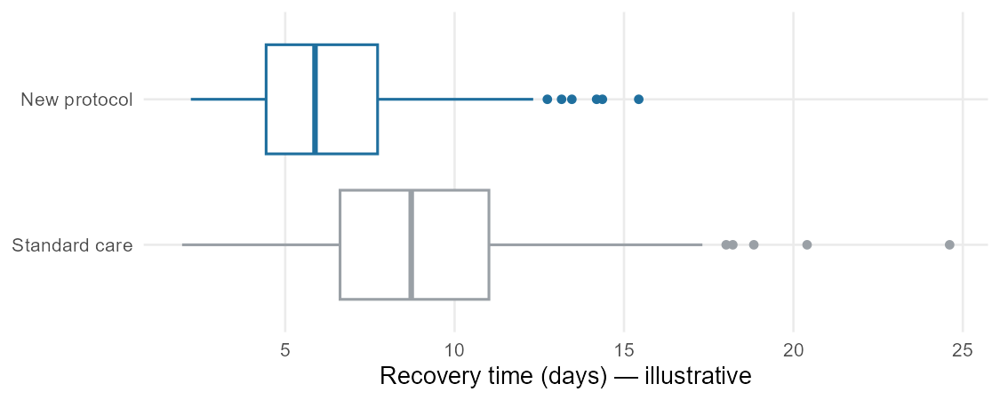

## Why this week matters

Last week you described one variable at a time. But most real
questions are **comparisons**: Does the new treatment shorten recovery
compared with standard care? Is the failure rate lower in one group
than another? Did the outcome differ across the genotypes?

A comparison is just two (or more) one-variable summaries placed side
by side — but the new skill is reading the *difference* between groups
honestly. This week you learn to compare a numerical outcome across
groups (difference in centers and spreads) and to compare a
categorical outcome across groups (difference in proportions), and to
tell the difference between a difference that is *large in the numbers*
and one that *matters in practice*.

One boundary up front: this week is still **descriptive**. We compare
what the groups actually did. The question "could this difference be
just chance?" is real, and we will spend Weeks 11 and 12 on it. For
now, we describe the observed gap clearly and resist over-claiming.

## Comparing a numerical outcome across groups

When the outcome is numerical and you want to compare it across groups
defined by a categorical variable, the workhorse display is the
**side-by-side box plot**: one box plot per group, drawn on the same
scale.

{fig-alt="Two horizontal box plots on the same scale comparing recovery time in days for standard care versus a new protocol; the new protocol has a lower median and is shifted toward shorter times."}

Read it the same way you read one box plot, but now you compare:

- **Center.** Which group's median is higher? By how much? The
  difference in medians (or in means) is the headline of the
  comparison — the spine's "difference in means."
- **Spread.** Is one group more variable than the other? Compare the
  box lengths (IQRs) and the whiskers.
- **Shape and outliers.** Is one group more skewed? Does one group
  have outliers the other lacks?

**Overlaid (hollow) histograms** are a good companion display: they
show the shape of each group's distribution more fully than a box
plot, at the cost of being busier. Use a box plot to compare center
and spread quickly; reach for histograms when shape matters.

When you report a numerical comparison, name the **size** of the
difference in context: "median recovery was about 2 days shorter under
the new protocol" tells the reader far more than "the groups
differed."

## Comparing a categorical outcome across groups

When the outcome is categorical, the comparison runs on **proportions,
not raw counts**. This is the single most common mistake in group
comparison, so it is worth stating plainly: if the groups are
different sizes, comparing raw counts is misleading. Always compare the
*rate* — the proportion in each group.

### Two-way tables

A **two-way table** (also called a **contingency table**) cross-tabs
two categorical variables: one defines the groups, the other the
outcome. Here is the result of a real peanut-allergy prevention trial,
in which infants were assigned to either avoid or consume peanut
products, and later tested with an oral food challenge (OFC):

| Group | Failed OFC | Passed OFC | Total |
|---|---:|---:|---:|
| Avoidance | 36 | 227 | 263 |
| Consumption | 5 | 262 | 267 |
| **Total** | **41** | **489** | **530** |

The **row totals** and **column totals** around the edge are the
**marginal totals**. The interesting question is not "how many failed"
but "what *fraction* of each group failed."

### Conditional proportions

To compare the groups, compute the proportion of each group that had
the outcome — a **conditional proportion** (the outcome rate
*conditional on* being in that group):

- Avoidance group: $36 / 263 \approx 0.14$, so about **14%** failed.
- Consumption group: $5 / 267 \approx 0.019$, so about **2%** failed.

That is the comparison: a 14% failure rate versus a 2% failure rate.
The **difference in proportions** is about 12 percentage points — a
large gap. (You may recognize these as the LEAP numbers from Week 1;
now you are reading them as a formal group comparison.)

Be careful which way you condition. The proportion of the *avoidance
group* that failed (14%) answers "how risky was avoidance?" The
proportion of those who *failed* who were in the avoidance group is a
different number answering a different question. Condition on the
**group** (the explanatory variable) when you want to compare outcome
rates across groups.

### Bar charts for two categorical variables

Two bar charts display this comparison, and they answer different
questions:

{fig-alt="Left: stacked count bars for the avoidance and consumption groups. Right: standardized proportion bars showing a much larger failed-OFC fraction in the avoidance group than the consumption group."}

- A **stacked bar chart** of counts shows how big each group is, but
  makes it hard to compare rates because the groups are different
  sizes.
- A **standardized (filled) bar chart** rescales every bar to 100%, so
  each bar shows the *proportion* in each outcome. This is the display
  that makes a difference in rates jump out — when the colored
  segments are different heights across groups, the two variables are
  **associated**.
- A **dodged (side-by-side) bar chart** places the bars next to each
  other rather than stacking them; it is good for reading individual
  counts but needs more room.

Pick the display that answers your question. To compare rates across
groups, the standardized bar chart is usually the clearest choice.

## Is the difference real? (a Week-4 boundary)

When two groups differ, three explanations are always on the table,
and you already have the vocabulary for the first two from Weeks 1–2:

1. **The design.** Was this an experiment with random assignment, or
   an observational study? Random assignment (as in the peanut trial)
   supports a causal reading of the difference. An observational
   difference may be driven by a **confounder** — and untangling that
   is the Week 6 topic, so we only flag it here.
2. **Practical vs numerical importance.** A difference can be real and
   still be too small to matter, or be measured in units that sound
   big but aren't. "Statistically there is a gap" is not the same as
   "this gap changes what a clinician should do." Always ask how big
   the difference is *in context*.
3. **Chance.** Even with no real underlying difference, two groups will
   rarely come out exactly equal. Deciding whether an observed gap is
   more than chance noise is the heart of Weeks 11–12. This week we do
   **not** make that call; we describe the observed difference and
   leave the "is it beyond chance?" question for later.

You may sometimes see a group comparison summarized as a single ratio
— for instance, "the failure rate was about seven times higher in the
avoidance group." That is a useful, intuitive way to describe how two
rates compare, and it is fine to read it that way this week. The formal
machinery for these ratios comes later in the course, when we study
categorical outcomes in depth; for now, treat it as plain language for
"one group's rate relative to another's."

## Worked example: reading a group comparison

A hospital compares **recovery time** (in days) for patients on a new
post-surgical protocol versus standard care, using side-by-side box
plots. The standard-care median is about 8 days with an IQR of roughly
5 days; the new-protocol median is about 6 days with a similar IQR.
Both distributions are right skewed, and the standard-care group has a
couple of high outliers.

A careful reading:

- **Center:** median recovery is about 2 days shorter under the new
  protocol (6 vs 8 days) — that is the headline difference.
- **Spread:** the two groups are about equally variable (similar
  IQRs), so the new protocol shifts the typical patient earlier
  without making recovery times wildly more or less consistent.
- **Shape and outliers:** both right skewed; the standard-care group's
  high outliers are the longest recoveries and are worth investigating.
- **What we can and can't say:** *if* patients were randomly assigned
  to protocols, a 2-day shorter median is a defensible signal that the
  protocol helps. *If* this was observational (clinicians chose which
  patients got the new protocol), a confounder — sicker patients kept
  on standard care, say — could explain the gap, and we would hold off
  on a causal claim. Either way, we report the 2-day difference in
  context and save the "is it beyond chance?" question for later.

## Common mistakes

- **Comparing raw counts across unequal groups.** Always compare
  proportions (rates) when the groups are different sizes.
- **Conditioning the wrong way.** "What fraction of the avoidance group
  failed?" and "what fraction of those who failed were avoiders?" are
  different questions. Condition on the group to compare outcome rates.
- **Using a stacked count chart to compare rates.** Stacked counts hide
  rate differences; use a standardized (proportion) bar chart.
- **Reading a descriptive difference as a proven cause.** A group
  difference supports a causal claim only when the design (random
  assignment) earns it; otherwise a confounder may be at work.
- **Confusing "large number" with "important."** State the size of the
  difference in context and ask whether it matters in practice.
- **Declaring a difference "real" from the data alone.** Whether a gap
  is beyond chance is a Week 11–12 question, not a Week 4 one.

## What you should be able to do by Friday

By the end of Week 4 you should be able to:

- Compare a numerical outcome across groups with side-by-side box plots
  (and overlaid histograms), reading differences in center, spread, and
  shape.
- Build and read a two-way table, including marginal totals.
- Compute and interpret **conditional proportions**, and report a
  **difference in proportions** between groups.
- Choose the right categorical display (stacked, standardized, or
  dodged bar chart) for the comparison you want to make.
- State the **size** of an observed difference in context and
  distinguish numerical from practical importance.
- Explain why a group difference does or does not support a causal
  claim, based on the study's design.
- Recognize that "is the difference beyond chance?" is a later question
  and not over-claim from descriptive comparisons.

## Assignments this week

- 📄 **Monday exit ticket** — short concept check: choose a comparison
  display and compute a difference in proportions from a two-way table.
  Aim for **3–5 minutes**. \
  [Download the Monday exit ticket (PDF)](../assets/assignments/week04_monday_exit_ticket_student.pdf)
- 📄 **Wednesday exit ticket** — read a side-by-side box plot or a
  two-way table and describe how the groups differ, in context. Aim for
  **8–12 minutes**. \
  [Download the Wednesday exit ticket (PDF)](../assets/assignments/week04_wednesday_exit_ticket_student.pdf)
- 🔒 **Friday quiz** — handled through Blackboard or in class as
  directed. The quiz prompt is not posted here. Exact timing and
  submission details live in Blackboard.
- 🔒 **Homework 2 (biweekly, covers Weeks 3–4)** — posted and submitted
  through Blackboard. The due date is on Blackboard.

*(In-class exit-ticket handouts are distributed in class or through
Blackboard.)*

## Read more in IMS / ISLBS

The course page above is the main explanation. If you want a second
voice on this week's material:

- **IMS** — *Introduction to Modern Statistics* (2e),
  [Chapter 4, "Exploring categorical data"](https://openintro-ims.netlify.app/explore-categorical):
  contingency tables, row/column proportions, stacked, standardized,
  and dodged bar charts, and the "comparing numerical data across
  groups" section (side-by-side box plots and overlaid histograms).
- **ISLBS** — *Introductory Statistics for the Life and Biomedical
  Sciences*,
  [Chapter 1](https://www.openintro.org/book/biostat/), the
  "Relationships between two variables" section — two categorical
  variables (contingency tables and proportions) and a numerical
  variable compared across a categorical one (side-by-side box plots) —
  for the same ideas in a clinical and biological context.

These are alternate readings, not replacements for the page above.

---

*Sources adapted in this lesson:* OpenIntro *Introduction to Modern
Statistics* (2e), Çetinkaya-Rundel & Hardin, Chapter 4 ("Exploring
categorical data"), §§ contingency tables and bar plots, visualizing
two categorical variables, row and column proportions, and comparing
numerical data across groups; CC BY-SA 3.0. Also OpenIntro
*Introductory Statistics for the Life and Biomedical Sciences*, Vu &
Harrington, Chapter 1, "Relationships between two variables" section,
CC BY-SA 3.0. Source files at
[github.com/openintrostat/ims](https://github.com/openintrostat/ims)
and
[github.com/OI-Biostat/oi_biostat_text](https://github.com/OI-Biostat/oi_biostat_text).
The peanut-allergy trial is the LEAP study, Du Toit et al., *NEJM* 372
(2015) 803–813; the two-way table and bar charts use its reported
counts. The side-by-side box-plot figure uses illustrative data
generated for teaching.
