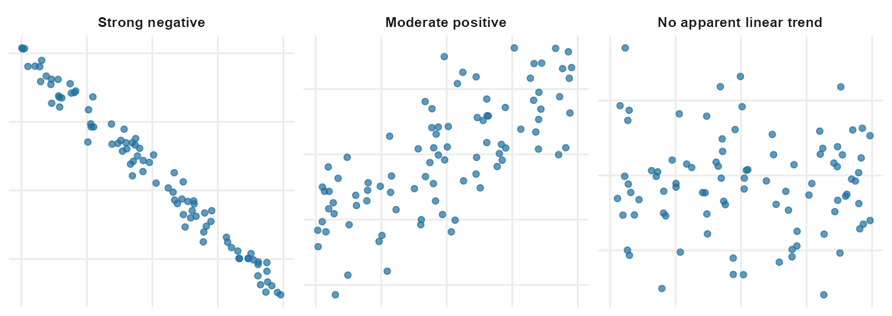
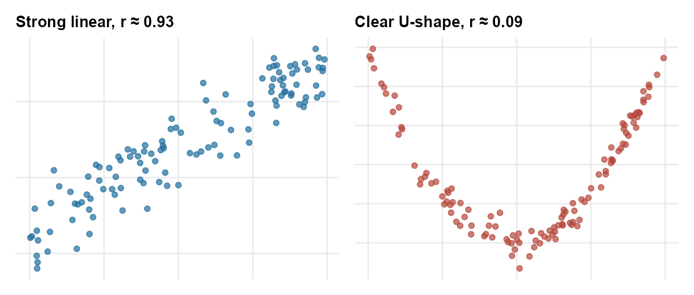
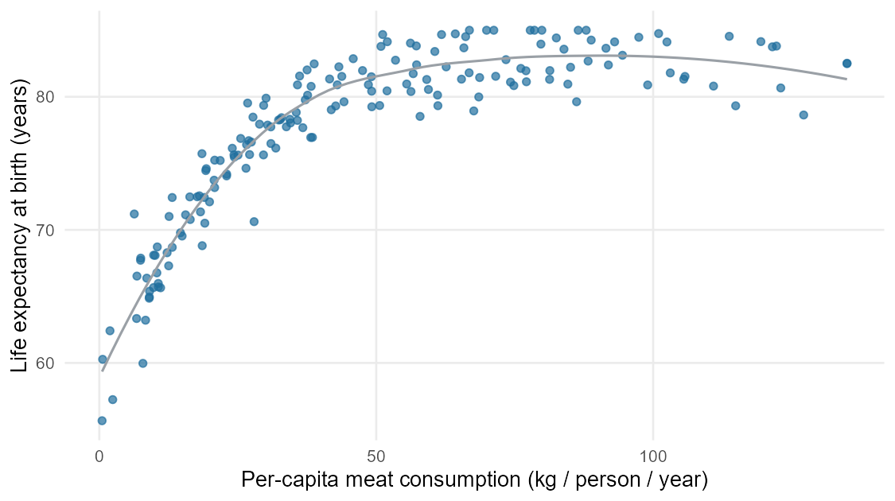

## Why this week matters

So far this term we have been reading **one variable at a time**.
Week 3 asked how a single column of a dataset is distributed; Week 4
asked how a single outcome differs across groups. Both habits read
the data one dimension at a time.

This week we add the natural next question: **are two variables
related to each other?** Does longer hospital stay tend to go with
higher costs? Does higher meat consumption per person in a country
tend to go with longer life expectancy? Does a higher score on
midterm one tend to go with a higher course grade overall?

There are two main tools for this kind of question when both
variables are numerical: a picture called a **scatterplot** and a
single number called the **correlation coefficient**. By Friday you
should be able to read a scatterplot honestly, report a correlation
without overstating it, and recognize the most common reading errors
— in particular, the move from *X and Y are associated* to *X causes
Y*, which the data almost never actually license.

Two big cautions sit on top of everything this week:

- A correlation summarizes the **linear** part of a relationship.
  Two variables can be strongly related and still have a correlation
  near zero, if the pattern is curved.
- An association does not, by itself, mean a causal story. Week 6
  will spend the whole week on the most common reason this trips
  people up.

## A scatterplot reads two columns at once

A **scatterplot** displays one numerical variable on the x-axis and
another numerical variable on the y-axis. Each **case** in the
dataset is one point. The position of the point shows that case's
values for both variables.

If the cases form a cloud that trends upward (low x with low y, high
x with high y), we call that a **positive association**. If the
cloud trends downward (low x with high y, high x with low y), it's a
**negative association**. If the cloud has no clear up-or-down
direction, the two variables show **no apparent linear
relationship**.

There are four things to read off a scatterplot, in roughly this
order:

- **Direction.** Does the cloud trend up, down, or have no obvious
  direction?
- **Form.** Is the cloud roughly straight, or is it curved? A curved
  trend is still a relationship — it just isn't a linear one.
- **Strength.** Is the cloud a tight pencil-thin line, or a diffuse
  cloud? Tight is strong, diffuse is weak.
- **Unusual points.** Does any single point sit far from the rest of
  the cloud? Those points can pull summary numbers around and
  deserve a look.

{fig-alt="Three scatterplots side by side. The first shows points trending sharply downward from upper left to lower right. The second shows points trending mildly upward with substantial scatter. The third shows points scattered with no apparent trend."}

When you describe a scatterplot in writing, you should be able to
hit all four points in two or three sentences. For example:

> *In this scatterplot of weight (kg) against height (cm) for 507
> physically active adults, taller individuals tend to be heavier
> (positive direction). The relationship looks roughly linear, with
> moderate-to-strong strength: the cloud is fairly tight around an
> upward trend. A few points sit at the upper-right corner with
> noticeably higher weights than the rest of the cloud at the same
> height; they are unusual but not implausible.*

That's the kind of sentence we want by the end of the week.

## Correlation: a single number for a single idea

Reading a scatterplot is the first step. A single number, the
**correlation coefficient**, summarizes the **strength and
direction** of the **linear** part of the relationship.

The correlation is written as **r**. It always sits between **-1 and
+1**. The sign matches the direction of the linear trend, and the
size of the number matches the strength:

- $r = +1$ means the points lie exactly on an upward-sloping line.
- $r = -1$ means the points lie exactly on a downward-sloping line.
- $r$ near 0 means there is **no apparent linear relationship**.
- A value like $r = 0.85$ is a strong positive linear association;
  $r = -0.30$ is a weak negative one.

A handful of facts about $r$ that the lesson page will keep coming
back to:

- $r$ has **no units**. It does not change when you switch the
  x-axis from inches to centimeters, or the y-axis from kilograms to
  pounds. The picture would look the same; the number is the same.
- $r$ **only sees the linear part of the relationship**. Two
  variables can have a strong, clean, U-shaped relationship and
  still produce a correlation near zero, because the upward half
  and the downward half of the U cancel each other.
- $r$ is a **descriptive number**, not a verdict. A correlation of
  0.7 does not mean "70% of the relationship is explained" and
  certainly does not mean "X causes 70% of Y." It is a single
  summary of the linear trend, no more.

You will not compute $r$ by hand in this course. The formula exists
and is in the IMS and ISLBS chapters at the end of this page if you
want to see it; we will read $r$ from displays and from output, but
we will not crank it out.

{fig-alt="Two scatterplots side by side. The first shows points along a tight upward line with r equals about 0.85. The second shows points in a clear U shape with r equals about 0.0."}

The single most common reading mistake at this stage is to look at a
reported $r$ near zero and conclude that the two variables are
unrelated. Always look at the picture too: a curved relationship is
still a relationship, and the linear summary will miss it.

## Two-way tables — a one-paragraph callback

If both variables are **categorical** (not numerical), the natural
tool is the **two-way table** you met in Week 4. Conditional
proportions inside that table — the percent of each outcome within
each group — play the same role for two categorical variables that
scatter and correlation play for two numerical variables. We will
not re-teach the table here. The point is just that *association
between two variables* is the same broad question regardless of
type; the **display and summary number change with the variable
types**, but the underlying habit (read the cloud / table, describe
direction and strength, do not overclaim) does not.

## A worked example: meat consumption and life expectancy

A 2022 study collected per-capita meat intake (in kilograms per
person per year, averaged across 2011–2013) for 175 countries
together with life expectancy at birth. Plotted as a scatterplot,
the relationship looks like this.

{fig-alt="Scatterplot with per-capita meat consumption on the x-axis and life expectancy at birth on the y-axis. The cloud trends upward and is moderately tight; some countries with low meat consumption have a wide range of life expectancies."}

Read this scatterplot the way the section above described.

- **Direction.** Positive. Countries with higher per-capita meat
  consumption tend to have higher life expectancies.
- **Form.** Roughly linear once you get above the lowest meat
  consumption levels. At the very low end of the x-axis the cloud
  fans out — many of those low-meat-consumption countries have a
  wide range of life expectancies.
- **Strength.** Moderately strong. The correlation here is around
  $r \approx 0.7$. That is a real signal in the picture: you can
  see the upward trend without squinting.
- **Unusual points.** A handful of countries do not fit the cloud —
  some have very low meat consumption but quite high life expectancy,
  and a few have moderate meat consumption with unusually low life
  expectancy. They are worth looking at individually rather than
  ignoring.

So far, so descriptive. The hard question is the next one:

> Does *eating more meat* cause longer life expectancy?

Almost certainly not, at least not in the simple way the headline
would suggest. There is a much more obvious explanation that the
data have not ruled out: **the wealth of the country.** Wealthier
countries tend to consume more meat *and* tend to have better
healthcare, cleaner water, better sanitation, and longer life
expectancies. Wealth is associated with both variables; it is
plausibly the real driver. This is the **confounding** idea from
Week 2, and it is the focus of Week 6, where we revisit this exact
same dataset and look at the same relationship within income
brackets.

The Week 5 honesty habit is to stop at: *we have a real, positive,
moderately strong association between meat consumption and life
expectancy across countries. We have not shown causation.*

## Association versus causation in headlines

Headlines almost always overstate what the data actually show. The
clearest tell is when a headline uses *causes*, *cuts*, *protects
against*, or *raises the risk of*, but the underlying study only
showed an **association**. A short habit that catches most of these:

1. **Find the study.** Read the abstract, not the headline. Was
   this an observational study or an experiment? (Week 2.)
2. **Find the design.** If it is observational, the language should
   be "associated with," "linked to," or "correlated with." If the
   article says "causes," ask why.
3. **Find a plausible third variable.** Could something else be
   driving both X and Y? In the meat-and-life-expectancy example,
   wealth is the obvious candidate. (Week 6.)
4. **Find the size and the form.** A reported $r$ of 0.2 is a weak
   linear trend. A reported $r$ of 0.9 between two variables that
   are essentially the same thing (e.g., height in inches and
   height in centimeters) is a measurement-redundancy, not a
   discovery.

This is the Friday quiz: read a short health-or-science headline,
identify the study type and the reported summary, and decide
whether the headline's language is honest with the data.

## Common mistakes

These come up every Week 5 and are worth heading off now.

- **"$r$ near 0 means no relationship."** No. It means **no
  *linear* relationship**. The U-shaped picture above has a strong
  relationship and $r$ near 0.
- **"Big $r$ means causation."** It does not. A large positive
  correlation between two numerical variables in observational data
  tells you they move together — nothing about *why*.
- **"$r$ changes when I change units."** It does not. Switching
  height from inches to centimeters does not change the
  correlation between height and weight.
- **"$r = 0.5$ is twice as strong as $r = 0.25$."** Strength is
  about how tightly the cloud hugs a line. More technical
  explained-variation language belongs to a later chapter; this
  week, use correlation only as a descriptive summary of linear
  direction and strength.
- **"Two variables that are clearly related must have a high $r$."**
  Only if the pattern is approximately linear. Curved, U-shaped, or
  cyclical relationships can defeat $r$ even when the relationship
  is real and strong.

## What you should be able to do by Friday

By the end of Week 5 you should be able to:

- Read a scatterplot of two numerical variables and describe its
  **direction**, **form**, **strength**, and any **unusual points**
  in two or three honest sentences.
- Match a reported correlation $r$ to one of several scatterplots,
  and (the reverse) estimate roughly whether $r$ is near $+1$, $-1$,
  or $0$ from a picture.
- Explain why $r$ alone is **not** enough — that a near-zero
  correlation can hide a strong nonlinear relationship, and that a
  large correlation between observational variables does not
  license a causal claim.
- Recognize when a headline's language has outrun what the
  underlying study supports.

## Assignments this week

- **Monday check.** A short concept check on reading a scatterplot
  and matching a correlation to a picture. Aim for about
  **3–5 minutes** in class. Sheet:
  [Week 5 Monday exit ticket](../assets/assignments/week05_monday_exit_ticket_student.pdf).
- **Wednesday check.** A short application on reading direction,
  form, strength, and unusual points in a clinical or public-health
  scatterplot; classifying a reported correlation. Aim for about
  **8–12 minutes** in class. Sheet:
  [Week 5 Wednesday exit ticket](../assets/assignments/week05_wednesday_exit_ticket_student.pdf).
- 🔒 **Friday quiz** — handled through Blackboard or in class as
  directed. The quiz prompt is not posted here. Exact timing and
  submission details live in Blackboard.
- 🔒 **Homework 3 (biweekly, covers Weeks 5–6)** — posted and
  submitted through Blackboard. Due near the start of Week 7;
  exact due date is on Blackboard.

## Read more in IMS / ISLBS

The course page above is the main explanation for this week. If you
want a second voice on the same material, these readings cover the
same concepts at similar depth:

- **IMS — Chapter 7 ("Linear regression with a single predictor"),
  the opening section and §7.1.4 *Describing linear relationships
  with correlation*.** Stop before §7.2 (least squares fitting) —
  that is Week 8 material in this course. \
  Hosted IMS book: <https://openintro-ims.netlify.app/>
- **ISLBS — *Introductory Statistics for the Life and Biomedical
  Sciences*, Chapter 1 §1.6 *Two numerical variables*** (scatter
  and correlation). \
  OpenIntro book page: <https://www.openintro.org/book/biostat/>

---

*Sources adapted in this lesson:* OpenIntro *Introduction to Modern
Statistics* (2e), Çetinkaya-Rundel & Hardin, Chapter 7 (*Linear
regression with a single predictor*), §7.1 scatter framing + §7.1.4
*Describing linear relationships with correlation*, CC BY-SA 3.0;
and OpenIntro *Introductory Statistics for the Life and Biomedical
Sciences*, Vu & Harrington, Chapter 1 §1.6 *Two numerical
variables*, CC BY-SA 3.0. Source files at
[github.com/openintrostat/ims](https://github.com/openintrostat/ims)
and
[github.com/OI-Biostat/oi_biostat_text](https://github.com/OI-Biostat/oi_biostat_text).
The meat-and-life-expectancy data are real and come from
You W. et al., *Meat consumption providing a surplus energy in
modern diet contributes to obesity and related metabolic disorders*,
*BMC Nutrition* 8 (2022); the figure here uses the country-level
2011–2013 averages summarized in that paper.
