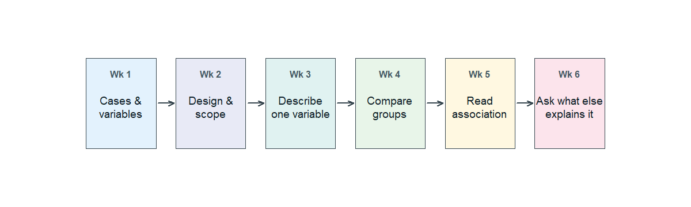

## Why this week matters

The first six weeks have given us a way to read data honestly.
Week 1 named what counts as data — cases, variables, the difference
between what we're studying and what we're explaining it with.
Week 2 asked where the data came from, and what we can and can't
responsibly say with it. Weeks 3 and 4 walked through how to
describe one variable and how to compare two or more groups. Week 5
introduced association between two numerical variables — the
scatterplot, the correlation, the cautious "they move together."
Week 6 introduced the one big complication: a third variable may be
doing the work.

This week we pause and bring those six habits together. The Friday
class meeting is the **midterm exam (Friday, October 9, in class)**.
This page is the assigned reading for the week — not a review
checklist, but a single coherent walkthrough of how the six units
fit together on one connecting study, with a couple of side
scenarios where one unit needs a fresher example. Read it the way
you would read a long worked example.

## The first-half arc in one sentence

Week 1 asks *what is this data?* Week 2 asks *where did it come
from?* Weeks 3 and 4 ask *what does one variable look like, and
how do the groups compare?* Week 5 asks *are two variables
related?* Week 6 asks *what else could explain that?* The midterm
asks you to do all of those in order on one new study.

{fig-alt="A six-step horizontal flow diagram. Each step is a labeled rounded rectangle, in order from left to right: cases and variables; design and scope; describe one variable; compare groups; read association; ask what else explains it. Arrows connect the steps in order from left to right."}

## Cases, variables, and study design

Our running case for this page is the country-level meat ×
life-expectancy dataset from Week 5. Researchers compiled
per-capita meat consumption (in kg per person per year, averaged
across 2011–2013) and life expectancy at birth for 175 countries.
We saw the aggregate scatter in Week 5, then revisited it
stratified by income bracket in Week 6.

To read this study the Week 1 way, name the cases and the
variables. The **cases** are countries, one country per row. The
**variables** are per-capita meat consumption (numerical, in kg
per person per year), life expectancy at birth (numerical, in
years), and a third variable we used in Week 6 — per-capita GDP,
which split countries into low-, middle-, and high-income
brackets (categorical when used as a tercile; numerical
underneath). Meat consumption plays the role of the **explanatory**
variable; life expectancy is the **response**.

To read it the Week 2 way, identify the design. These are
**observational** country-level data, not an experiment — no one
randomized countries to high or low meat consumption. The **scope
of inference** is country-level associations as they were in
roughly 2011–2013, with the standard caution that observational
data does not by itself license causal language.

## Describing one variable

Before comparing or relating two variables, it helps to read each
of them alone. Life expectancy at birth across these 175 countries
ranges from roughly the mid-50s to the low 80s, with a center
around the upper 70s and a clear left skew — there is a long tail
of countries with low life expectancy and a tight cluster of
countries at the high end. Per-capita meat consumption ranges
from near zero to over 100 kg per person per year, with a right
skew — most countries fall under 60 kg, and a small group of
high-meat countries pulls the upper tail.

The Week 3 habit is: name the center, the spread, the shape, and
any unusual points. A short paragraph in that pattern is a good
description; *"the median is about X, the spread is about Y, the
shape is roughly Z, with a few unusual countries at W"* is the
kind of honest sentence the midterm rewards.

## Comparing groups

The meat case is not a clean group-comparison example on its
own, so use this short scenario instead. Imagine a small clinical
trial: 200 adults with high blood pressure are **randomly
assigned**, half to a new medication and half to a placebo. After
eight weeks, the medication group's average systolic blood
pressure is about **138 mm Hg**; the placebo group's average is
about **145 mm Hg**. The difference in average systolic blood
pressure is about **7 mm Hg**, in favor of the medication.

That's the Week 4 read: a **difference in means** of about 7 mm
Hg between the two groups. Because participants were randomly
assigned, the comparison is also a fair causal one in the Week 2
sense — random assignment is what makes us comfortable saying
"the medication appears to reduce blood pressure" rather than
only "the medication group had lower blood pressure on average."
A numerical difference and a causal license are two separate
questions; the midterm will want you to keep them separate.

## Reading association

Back to the meat case for the Week 5 read. The aggregate
scatterplot of life expectancy against per-capita meat consumption
trends **upward** — countries with higher meat consumption tend
to have higher life expectancies. The cloud is moderately tight
and roughly linear once you get above the lowest
meat-consumption levels; the correlation across the 171 countries
with non-missing values is approximately **r ≈ 0.72**.

The Week 5 honesty habit is the verdict here. There is a real,
positive, moderately strong **association** between meat
consumption and life expectancy across countries. The correlation
summarizes the **linear** part of that association — not its
causal direction. A high *r* tells us the cloud is tight around an
upward line. It does not tell us why.

## Asking what else could explain the relationship

The Week 6 move is to ask, *what else could explain that?* For
the meat case the obvious candidate is **the wealth of the
country**. Wealthier countries tend to consume more meat *and*
tend to have better healthcare, cleaner water, better sanitation,
and longer life expectancies. Wealth is plausibly **associated
with both** the explanatory variable and the response — the
textbook shape of a confounder.

Splitting the 171 countries into low-, middle-, and high-income
terciles by per-capita GDP and reading the scatter inside each
bracket showed within-bracket correlations of about **0.64**,
**0.33**, and **0.48** — all smaller than the aggregate
**0.72**. Most of what looked like a country-level "meat → longer
life" association was income doing the work. The Week 6 verdict,
in the *alone* / *after accounting for* phrasing: looking at the
meat–life-expectancy association *alone*, the data suggest a
moderately strong positive association; *after accounting for*
per-capita income, the within-bracket association is real but
much weaker. Stratification did not erase the relationship, but
it shrank it, and shifted what we can responsibly claim.

## Pulling the ideas together on one scenario

Here is one more, fresh, case to read in the same order. A 2024
report compares hospitals in a metropolitan area on **30-day
mortality after admission for heart failure**. Across all
hospitals, large urban academic medical centers have **higher**
30-day mortality than small community hospitals. A blog post
turns this into a headline: *"Big hospitals are worse for
heart-failure patients."*

Read this the Week 1 way: the cases are hospitals; the response
is 30-day mortality (a rate); the explanatory variable is
hospital type (urban academic vs small community —
categorical). Read it the Week 2 way: this is **observational**.
Patients were not randomly assigned to hospital type; they ended
up at one or the other through referral, geography, or severity
at admission. Read it the Week 4 way: there is a real
numerical difference in mortality rates between the two groups,
so the comparison is not nothing. Read it the Week 5 way: there
is an association between hospital type and mortality. And read
it the Week 6 way: **what else could explain it?** Large urban
academic centers tend to receive sicker patients — they have
specialists, equipment, and capacity, so referrals concentrate
the hardest cases there. If we **stratify** by severity at
admission (mild, moderate, severe), the urban-academic-versus-
community gap likely shrinks or reverses inside each stratum,
because we are then comparing comparable patients.

The honest one-sentence summary uses the Week 6 phrasing:
looking at hospital type *alone*, urban academic centers have
higher 30-day mortality; *after accounting for* severity at
admission, the picture changes — the data do not by themselves
support the headline.

## A small preview of next week

Next week we will fit a line to a scatterplot and learn to read
its slope. This week we are still in description.

## Common mistakes

These are the most common Units 1–6 mistakes worth retiring
before the midterm.

- **Calling an observational association causal.** An association
  between two variables in observational data is real, but it is
  not by itself a causal story (Wk 2 and Wk 5).
- **Reading a low correlation as "no relationship."** A near-zero
  *r* means no apparent *linear* trend. A curved relationship can
  be strong and still produce *r* near zero (Wk 5).
- **Forgetting to name the scope of inference.** "These data
  show…" should be followed by a clear sense of *who and when* —
  the population the sample represents, and the time the data
  describe (Wk 2).
- **Comparing groups without checking the comparison's basis.** A
  difference in means or proportions is the Wk 4 number, but
  whether it supports a causal claim depends on the Wk 2 design.
- **Mistaking the *size* of an association for its *direction*.**
  A small correlation and a small slope of the cloud are not
  exactly the same as no relationship, and a large correlation
  does not by itself mean a large practical effect (Wk 5).
- **Stopping at the aggregate.** When two variables move
  together, ask *what else could explain that?* before describing
  the relationship as the bottom line (Wk 6).

## What you should be able to do by Friday

By Friday you should be able to, on a new short scenario you
have not seen:

- name the cases, the variables (numerical vs categorical;
  response vs explanatory), and the scope of inference;
- classify the study as observational or experimental, and say
  what each design can support;
- describe one variable in a short table or graph using center,
  spread, shape, and any unusual values;
- compute and read a difference in means or a difference in
  proportions between two or more groups;
- read direction, form, strength, and unusual points from a
  scatterplot, and report a correlation *r* as a descriptive
  summary;
- name a plausible confounder for an observational association,
  and write a one-sentence *alone* / *after accounting for*
  description of what changes when you stratify on it;
- write a short, honest conclusion from a graph and a table
  together — without overclaiming what the design supports.

The midterm exam is **Friday, October 9, in class**, and
exercises this list directly.

## Assignments this week

- **Monday check.** A short concept check across Units 1–6. Aim
  for about **3–5 minutes** in class. Sheet:
  [Week 7 Monday exit ticket](../assets/assignments/week07_monday_exit_ticket_student.pdf).
- **Wednesday check.** A short mixed-scenario review with one
  small early-modeling question for next week. Aim for about
  **8–12 minutes** in class. Sheet:
  [Week 7 Wednesday exit ticket](../assets/assignments/week07_wednesday_exit_ticket_student.pdf).
- 🔒 **Friday — midterm exam (in class).** Case-based and
  interpretive, covering Units 1–6 and a small amount of
  early-modeling vocabulary. Bring a calculator. No external
  sources. Exact section details live in Blackboard.
- 🔒 **Homework 4 (biweekly, covers Weeks 7–8)** — posted and
  submitted through Blackboard. The Week 7 share is review; the
  Week 8 share uses next week's regression vocabulary. Due near
  the start of Week 9.

## Read more in IMS / ISLBS

This week opens no new chapters. To review a specific Wk 1–6
idea before the midterm, the assigned readings remain the IMS
and ISLBS chapters we have been using:

- **IMS — Chapters 1–3** (data basics, study design,
  applications) and **Chapter 7 §7.1.4** (correlation). The
  same chapter §7.2 begins next week's material; do not start
  it yet. \
  Hosted IMS book: <https://openintro-ims.netlify.app/>
- **ISLBS — Chapter 1** (data basics, study design,
  summarizing one variable, relationships between two
  variables) and the **DDS case in §1.7.1** as the Wk 6
  confounding anchor. \
  OpenIntro book page: <https://www.openintro.org/book/biostat/>

---

*Sources adapted in this lesson:* OpenIntro *Introduction to
Modern Statistics* (2e), Çetinkaya-Rundel & Hardin, Chapters
1–3 and Chapter 7 §7.1.4, CC BY-SA 3.0; and OpenIntro
*Introductory Statistics for the Life and Biomedical Sciences*,
Vu & Harrington, Chapter 1, CC BY-SA 3.0. Source files at
[github.com/openintrostat/ims](https://github.com/openintrostat/ims)
and
[github.com/OI-Biostat/oi_biostat_text](https://github.com/OI-Biostat/oi_biostat_text).
The meat-and-life-expectancy data are real and come from
You W. et al., *Meat consumption providing a surplus energy in
modern diet contributes to obesity and related metabolic
disorders*, *BMC Nutrition* 8 (2022).
